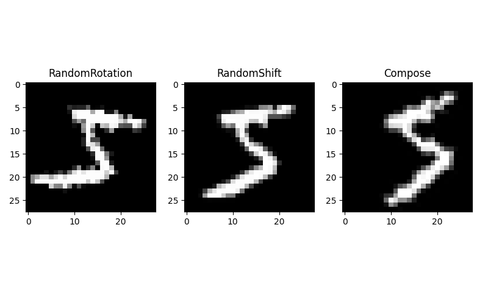
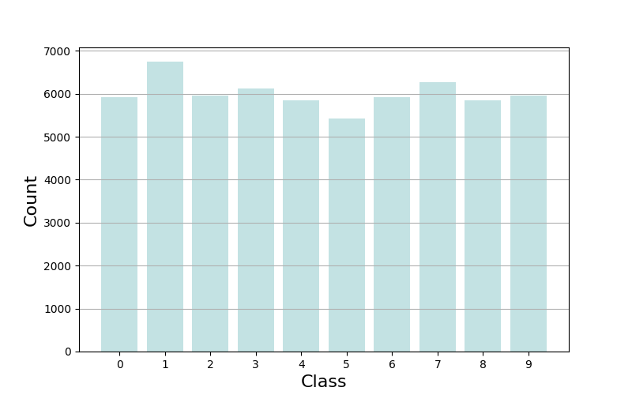
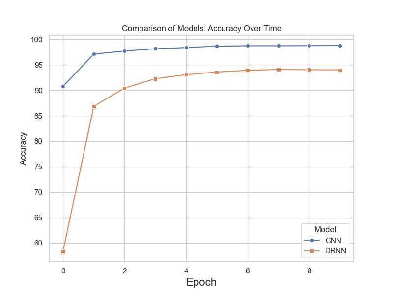
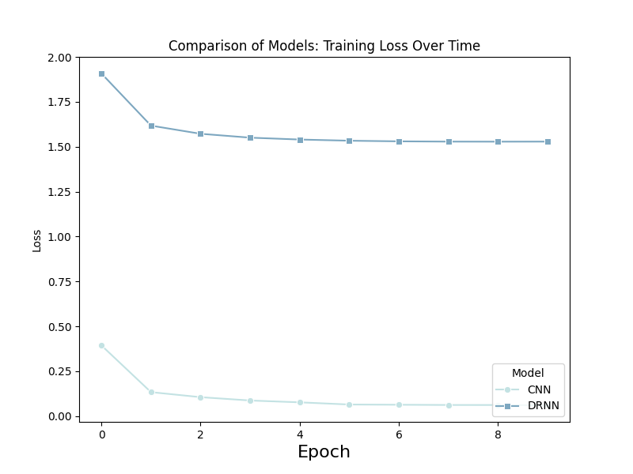
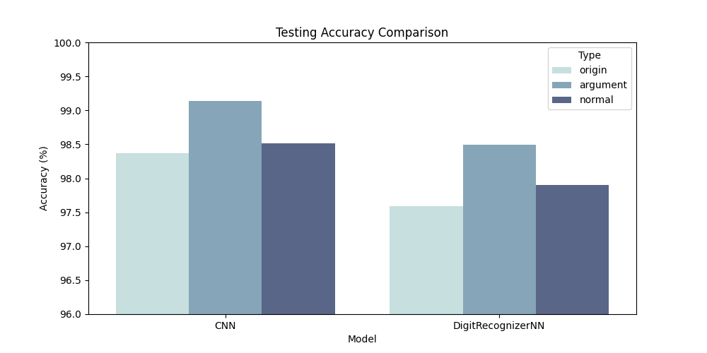
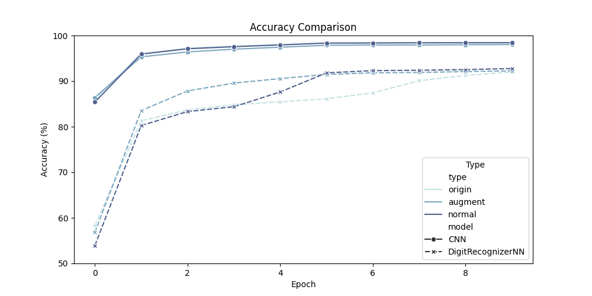
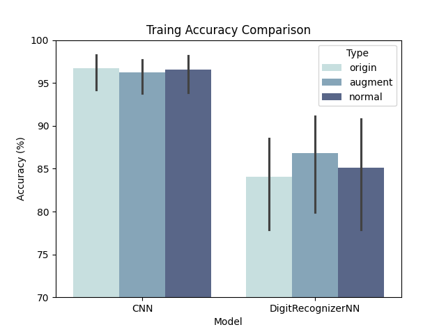
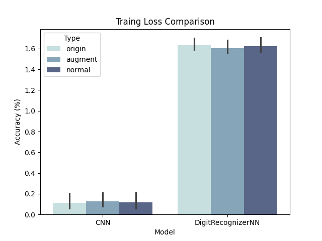

# MINIST Recognizer

    
    
    

## Abstract
This project focuses on developing a highly accurate model for recognizing handwritten
digits using the well-known MINIST dataset. The dataset comprises 2,400 unique images for
each digit (0 to 9) and serves as a fundamental resource in the realms of computer vision
and machine learning. The proposed solution introduces a Convolutional Neural Network
(CNN) model, known for its success in image recognition by mimicking human visual system
functionality to identify patterns and features.
To optimize performance, the project adopts a strategy of fine-tuning the CNN’s architecture.
This involves adjusting the parameters of convolutional layers, pooling layers, and
fully connected layers to enhance the model’s ability to extract features and improve recognition
results. Additionally, the project employs data augmentation techniques during training,
incorporating rotations and translations to diversify the dataset and improve the model’s generalization
on new, unseen data. This not only increases sample diversity but also mitigates
overfitting.
Key metrics such as accuracy and loss functions play a crucial role during training. Accuracy
reflects the model’s proficiency in recognizing digits, while the loss function measures
the disparity between predicted and actual values. Continuous optimization of these metrics
throughout training leads to gradual improvements in the model’s performance.

## Installation
- pip install -f environment.yml 
- run *main.py* file

## Methodology

### Structure of CNN

### Structure of DRNN

### Data Augment

#### Data Transfermation
These techniques include image rotation and translation operations. The purpose of this
approach is to increase the model’s robustness, enabling it to better adapt to input images at
various angles, scales, and orientations, thus improving overall prediction accuracy.

#### Normalization
During training, this project also applies a normalization process to the images. To be more
precise, both the mean and standard deviation are set to 0.5, ensuring that the results fall within
the range of [-1, 1].

The number of augmented images increases to between approximately 5,500
and 7,000.

## Performance

    
    

    
    

    
    

## Contributing

<table>
  <tr>
    <td align="center"><a href="https://github.com/IvanMao714"> <b>@IvanMao714</b></a></td>
    <td>
        <ol>
            <li> Design DRNN and CNN models (90 lines of the code)
            <li> Data Augment Class(60 lines of the code)
            <li> Data Processing (80 lines of the code)
            <li> Code of the training model (100 lines of the code)
        </ol>
    </td>
  </tr>
  <tr>
    <td align="center"><a href="https://github.com/Zachary886"> <b>@Zachary886</b></a>
    <td>
        <ol>
            <li> Generation of mode structure diagrams (60 lines of the code)
            <li> Generation of charts for reporting (90 lines of the code)
            <li> Report written 70%
            <li> Presentation
        </ol>
    </td>
  </tr>
</table>
